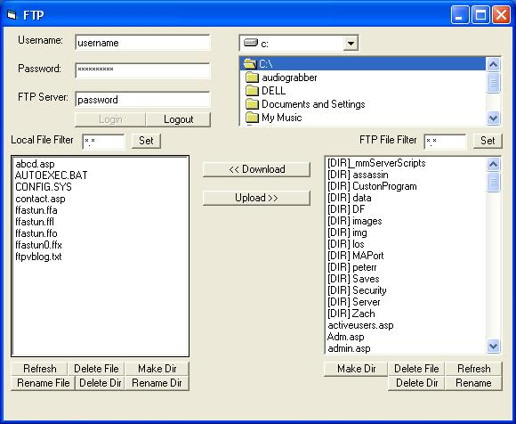



## Full FTP Client

### Description

This is a fully functional FTP client. You can rename files and folders, set filters, enumerate files and directories, and delete files and directories. Easy to use and understand.
 
### More Info
 

             |
---                |---
**Submitted On**   |2004-08-26 18:42:40
**By**             |[Eric Wolcott](https://github.com/Planet-Source-Code/PSCIndex/blob/master/ByAuthor/eric-wolcott.md)
**Level**          |Intermediate
**User Rating**    |4.8 (24 globes from 5 users)
**Compatibility**  |VB 3\.0, VB 4\.0 \(16\-bit\), VB 4\.0 \(32\-bit\), VB 5\.0, VB 6\.0
**Category**       |[Internet/ HTML](https://github.com/Planet-Source-Code/PSCIndex/blob/master/ByCategory/internet-html__1-34.md)
**World**          |[Visual Basic](https://github.com/Planet-Source-Code/PSCIndex/blob/master/ByWorld/visual-basic.md)
**Archive File**   |[Full\_FTP\_C1786298262004\.zip](https://github.com/Planet-Source-Code/eric-wolcott-full-ftp-client__1-55837/archive/master.zip)

